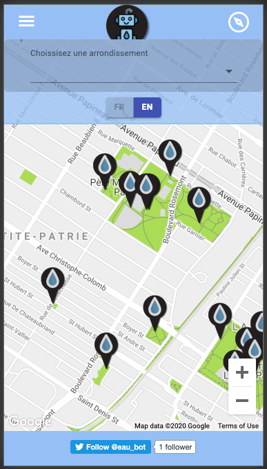
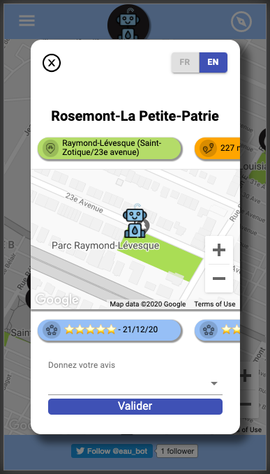

# Projet Fontaine - Eau Bot

Eau Bot is a project I created using a dataset from the <a href="https://donnees.montreal.ca/ville-de-montreal/fontaines-a-boire-eau-exterieures">Montréal Données Ouvertes<a> portal, which contains location data and metadata for all of the exterior public drinking fountains in Montréal.

My motivation was to take this data and create a tool that could inform users about where to find public infrastructure - I chose water fountains because access to clean water and reducing plastic use is something I care about. I also wanted to provide users an easy way to send direct feedback to the city about the state of its infrastructure, using the Twitter API on the backend and a dedicated twitter account <a href="https://twitter.com/eau_bot">@eau_bot<a>. Besides sending tweets based on user feedback, Eau Bot also retweets posts from various hashtags related to clean drinking water and public green spaces at a set interval - currently once every three hours or 10,800,000 ms.

Eau Bot has not gone live yet, I'm aiming to deploy this in the spring time after more optimization, perhaps adding functionality, and once drinking fountains come online after the winter months.

Technologies used:

FE: React.js, Javascript, Redux, Google Maps JavaScript API

BE: Node.js, Express, Twitter API, Mongo DB

NPM packages: React Icons, Material UI, Styled Components, Normalize.css, Moment, React Tooltip, Create React App, Twit, Nodemon

Demo video: 

